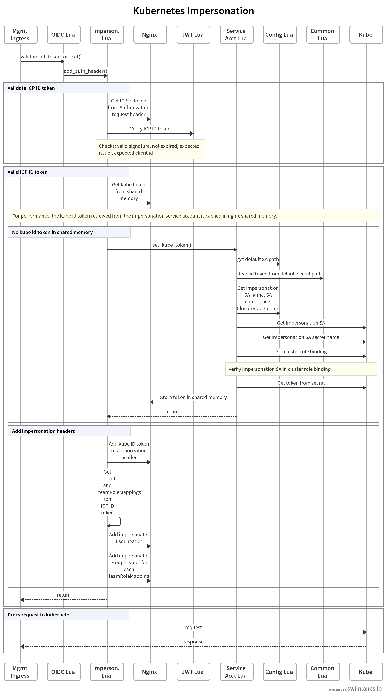

# icp-management-ingress
nginx based ingress controller to server all icp management service

The design doc is [here](https://github.ibm.com/IBMPrivateCloud/roadmap/blob/master/feature-specs/kubernetes/management-ingress-controller-refactor.md)

# annotations

| Name | Description | Values |
| --- | --- | --- |
| icp.management.ibm.com/auth-type | Authentication method for management service | string |
| icp.management.ibm.com/authz-type | Authorization method for management service | string |
| icp.management.ibm.com/rewrite-target | Target URI where the traffic must be redirected | string |
| icp.management.ibm.com/app-root | Base URI fort the server | string |
| icp.management.ibm.com/configuration-snippet | Additional configuration to the NGINX location | string |
| icp.management.ibm.com/secure-backends | uses https to reach the services | bool |
| icp.management.ibm.com/secure-verify-ca-secret | secret name that stores ca cert for upstream service | string |
| icp.management.ibm.com/secure-client-ca-secret | secret name that stores ca cert/key for client authentication of upstream server | string |
| icp.management.ibm.com/upstream-uri | URI of upstream | string |
| icp.management.ibm.com/location-modifier | Location modifier | string |
| icp.management.ibm.com/proxy-connect-timeout | proxy connect timeout | string |
| icp.management.ibm.com/proxy-send-timeout | proxy send timeout | string |
| icp.management.ibm.com/proxy-read-timeout | proxy read timeout | string |
| icp.management.ibm.com/proxy-buffer-size | buffer size of response | string |
| icp.management.ibm.com/proxy-body-size | max response body | string |
| icp.management.ibm.com/connection | override connection header | string |

# Impersonation support
## Overview
The ICP management ingress controller now supports the use of kubernetes impersonation which allows ICP to run on top
of other kubernetes providers such as IKS while still using the ICP user credentials. 

## Initial setup (done by the ICP installer)
* Create a namespace, which in turn, creates a default service account and token secret.  By default, the namespace is called `icp-system`.  Note: other 
service accounts can be used.  This information can be specified as environment variables to the icp-management-ingress pod.  This token is used and the impersonating user and needs to have cluster-admin role.
* Add this default service account to a cluster role binding to give this token cluster admin authority.  By default, the `admin-users` is updated.
* The environment variable `ENABLE_IMPERSONATION` is set to `true` in the icp-management-ingress deamonset.

## Processing
* When a kube api request comes into the icp-management-ingress pod, the oidc.lua validate_id_token_or_exit() method is called which ensures there
is an ICP id token set on Authorization header of the request.
* When impersonation is enabled, the oidc.lua module calls the impersonation code to add the impersonation headers:
  * The impersonation lua modules gets the kube token from the service account specified during install, by default this is `icp-system.default`.  Once
  the token is retreived, it is stored in a Nginx shared memory dictionary for faster retrieval.  Note that service account tokens do
  not expire.
  * Next, the ICP id token is retreived from the Authorization header and verified to make sure it's a valid token.  This is done by calling a JWT lua
  module which validates the token using the public key of the platform-auth certificate.  Also, the issuer, client_id, and token expiration is checked.
  * If the ICP ID token is valid then:
     * The subject and the team rolemappings are retreived from the ICP ID token.
     * The `Authorization` header is updated with the service account token as configured by install (the impersonating user).
     * An `Impersonate-user` header is added with the subject from the ICP ID token.
     * An `Impersonate-group` header is added for each teamrolemapping entry in the ICP ID token.
     * The request is then proxied to the kubernetes API and kubernetes will provide the RBAC based on the Impersonate headers.
## Swimlane Flow

Note: For impersonation to work, all kubernetes api requests that use ICP credentials must be sent to the icp-management-ingress pods, including client kubectl commands.  When you login to icp using the cloudctl command, the kubectl context is setup correctly to send those requests to the icp-managment-ingress
pod so the impersonation headers can be added to the request.

